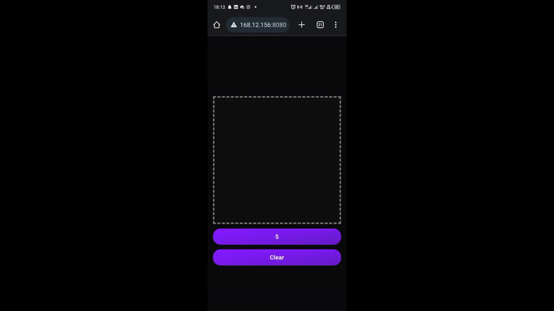

# DEMO

# MNIST_API

This is an API for the <a href="https://github.com/zaqks/MNIST_pytorch">MNIST</a> digit recognition system enables users to submit handwritten digit images for classification. It processes the input image, typically in a 28x28 grayscale format, and predicts the corresponding digit (0-9) using a trained machine learning model. The API supports functionalities such as image preprocessing (resizing and normalization), model inference, and returning the predicted class along with confidence scores. It is designed to integrate seamlessly with front-end applications, allowing real-time digit recognition for user-drawn inputs or uploaded images.
